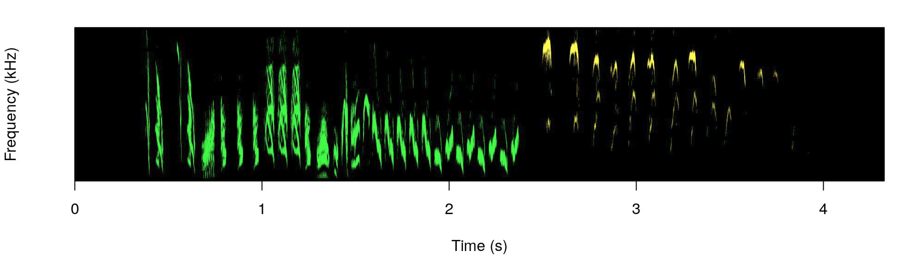
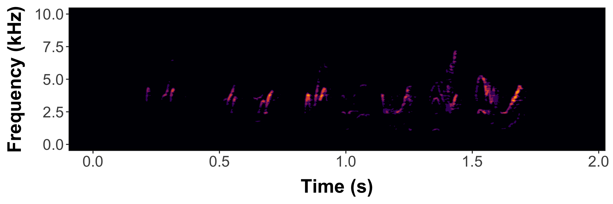
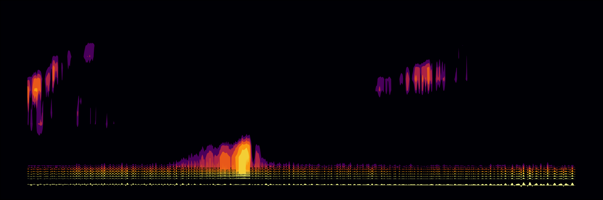

<!-- README.md is generated from README.Rmd. Please edit that file -->

```{r setup, include = FALSE}
knitr::opts_chunk$set(
  collapse = TRUE,
  out.width = "100%"
)
library(warbleR)
```

[](https://cran.r-project.org/package=dynaSpec) [](https://www.r-pkg.org:443/pkg/dynaSpec) [](https://r-pkg.org/pkg/dynaSpec) [](https://lifecycle.r-lib.org/articles/stages.html)

A set of tools to generate dynamic spectrogram visualizations in video format. [FFMPEG](https://ffmpeg.org/download.html) must be installed in order for this package to work. The package relies heavily on the packages [seewave](https://CRAN.R-project.org/package=seewave) and [tuneR](https://CRAN.R-project.org/package=tuneR).

Please cite [dynaSpec](https://marce10.github.io/dynaSpec/) as follows:

Araya-Salas, Marcelo & Wilkins, Matthew R.. (2020), *dynaSpec: dynamic spectrogram visualizations in R*. R package version 1.0.0.

Install/load the package from CRAN as follows:

``` r

# From CRAN would be
install.packages("dynaSpec")

#load package
library(dynaSpec)

# and load other dependencies
library(viridis)
library(tuneR)
library(seewave)
```

To install the latest developmental version from [github](https://github.com/) you will need the R package [devtools](https://cran.r-project.org/package=devtools):

``` r

# From github
devtools::install_github("maRce10/dynaSpec")

#load package
library(dynaSpec)
```
# Background
This package is a collaboration between [Marcelo Araya-Salas](https://marceloarayasalas.weebly.com/) and [Matt Wilkins](http://www.mattwilkinsbio.com/). The goal is to create static and dynamic visualizations of sounds, ready for publication or presentation, *without taking screen shots* of another program. [Marcelo's approach](#marcelos-approach-scrolling-dynamic-spectrograms) (implemented in the scrolling_spectro() function) shows a spectrogram sliding past a fixed point as sounds are played, similar to that utilized in Cornell's Macaulay Library of Sounds. These dynamic spectrograms are produced natively with base graphics. [Matt's approach](#matts-approach-paged-dynamic-spectrograms) creates "paged" spectrograms that are revealed by a sliding highlight box as sounds are played, akin to Adobe Audition's spectral view. This approach is in ggplot2 natively, and requires setting up spec parameters and segmenting sound files with prep_static_ggspectro(), the result of which is processed with paged_spectro() to generate a dynamic spectrogram.

<hr>
# Marcelo's Approach: "Scrolling Dynamic Spectrograms"  
<hr>
To run the following examples you will also need to load a few more packages as well as [warbleR](https://cran.r-project.org/package=warbleR) 1.1.24 (currently as the developmental version on github). It can be installed as follows:

``` r

# From github
devtools::install_github("maRce10/warbleR")

#load package
library(warbleR)
```

A dynamic spectrogram of a canyon wren song with a viridis color palette:

``` r


data("canyon_wren")

scrolling_spectro(wave = canyon_wren, wl = 300, 
              t.display = 1.7, pal = viridis, 
              grid = FALSE, flim = c(1, 9), 
              width = 1000, height = 500, 
              res = 120, file.name = "default.mp4")
```

<center>
<iframe allowtransparency="true" style="background: #FFFFFF;" style="border:0px solid lightgrey;" width="600" height="240" src="https://www.youtube.com/embed/TOiukDxaNbI" frameborder="0" allow="accelerometer; autoplay; encrypted-media; gyroscope; picture-in-picture" allowfullscreen>
</iframe>
</center>
 

Black and white spectrogram:

``` r

scrolling_spectro(wave = canyon_wren, wl = 300, 
          t.display = 1.7, pal = reverse.gray.colors.1, 
          grid = FALSE, flim = c(1, 9), 
          width = 1000, height = 500, 
          res = 120, file.name = "black_and_white.mp4",
          collevels = seq(-100, 0, 5))
```

<center>
<iframe allowtransparency="true" style="background: #FFFFFF;" style="border:0px solid lightgrey;" width="600" height="240" src="https://www.youtube.com/embed/5gQjgzijHOs" frameborder="0" allow="accelerometer; autoplay; encrypted-media; gyroscope; picture-in-picture" allowfullscreen>
</iframe>
</center>
 

A spectrogram with black background (colbg = "black"):

``` r

scrolling_spectro(wave = canyon_wren, wl = 300, 
              t.display = 1.7, pal = viridis, 
              grid = FALSE, flim = c(1, 9), 
              width = 1000, height = 500, res = 120, 
              file.name = "black.mp4", colbg = "black")
```

<center>
<iframe allowtransparency="true" style="background: #FFFFFF;" style="border:0px solid lightgrey;" width="600" height="240" src="https://www.youtube.com/embed/n_GNDn2VH-U" frameborder="0" allow="accelerometer; autoplay; encrypted-media; gyroscope; picture-in-picture" allowfullscreen>
</iframe>
</center>
 

Slow down to 1/2 speed (speed = 0.5) with a oscillogram at the bottom (osc = TRUE):

``` r

scrolling_spectro(wave = canyon_wren, wl = 300, 
              t.display = 1.7, pal = viridis, 
              grid = FALSE, flim = c(1, 9), 
              width = 1000, height = 500, res = 120, 
              file.name = "slow.mp4", colbg = "black",
              speed = 0.5, osc = TRUE, 
              colwave = "#31688E99")
```

<center>
<iframe allowtransparency="true" style="background: #FFFFFF;" style="border:0px solid lightgrey;" width="600" height="240" src="https://www.youtube.com/embed/r25TSKSklLo" frameborder="0" allow="accelerometer; autoplay; encrypted-media; gyroscope; picture-in-picture" allowfullscreen>
</iframe>
</center>
 

 

Long-billed hermit song at 1/5 speed (speed = 0.5), removing axes and looping 3 times (loop = 3:

``` r

data("Phae.long4")

scrolling_spectro(wave = Phae.long4, wl = 300, 
    t.display = 1.7, ovlp = 90, pal = magma, 
    grid = FALSE, flim = c(1, 10), width = 1000, 
    height = 500, res = 120, collevels = seq(-50, 0, 5), 
    file.name = "no_axis.mp4", colbg = "black", 
    speed = 0.2, axis.type = "none", loop = 3)
```

<center>
<iframe allowtransparency="true" style="background: #FFFFFF;" style="border:0px solid lightgrey;" width="600" height="360" src="https://www.youtube.com/embed/7AAoaZUkA3k" frameborder="0" allow="accelerometer; autoplay; encrypted-media; gyroscope; picture-in-picture" allowfullscreen>
</iframe>
</center>
 

Visualizing a northern nightingale wren recording from [xeno-canto](https://www.xeno-canto.org) using a custom color palette:

``` r

ngh_wren <- read_wave("https://www.xeno-canto.org/518334/download")

custom_pal <- colorRampPalette( c("#2d2d86", "#2d2d86", reverse.terrain.colors(10)[5:10]))

scrolling_spectro(wave = ngh_wren, wl = 600, 
    t.display = 3, ovlp = 95, pal = custom_pal, 
    grid = FALSE, flim = c(2, 8), width = 700, 
    height = 250, res = 100, collevels = seq(-40, 0, 5),
    file.name = "../nightingale_wren.mp4", colbg = "#2d2d86", lcol = "#FFFFFFE6")
```

<center>
<iframe allowtransparency="true" style="background: #FFFFFF;" style="border:0px solid lightgrey;" width="700" height="250" src="https://www.youtube.com/embed/OxvKoPyX-4o" frameborder="0" allow="accelerometer; autoplay; encrypted-media; gyroscope; picture-in-picture" allowfullscreen>
</iframe>
</center>
 

Spix's disc-winged bat inquiry call slow down (speed = 0.05):

``` r

data("thyroptera.est")

# extract one call
thy_wav <- attributes(thyroptera.est)$wave.objects[[12]]

# add silence at both "sides""
thy_wav <- pastew(tuneR::silence(duration = 0.05, 
            samp.rate = thy_wav@samp.rate, xunit = "time"),
            thy_wav, output = "Wave")

thy_wav <- pastew(thy_wav, tuneR::silence(duration = 0.04, 
            samp.rate = thy_wav@samp.rate, xunit = "time"),
            output = "Wave")

scrolling_spectro(wave = thy_wav, wl = 400, 
    t.display = 0.08, ovlp = 95, pal = inferno, 
    grid = FALSE, flim = c(12, 37), width = 700, 
    height = 250, res = 100, collevels = seq(-40, 0, 5),
    file.name = "thyroptera_osc.mp4", colbg = "black", lcol = "#FFFFFFE6", 
    speed = 0.05, fps = 200, buffer = 0, loop = 4, lty = 1, 
    osc = TRUE, colwave = inferno(10, alpha = 0.9)[3])
```

<center>
<iframe allowtransparency="true" style="background: #FFFFFF;" style="border:0px solid lightgrey;" width="700" height="250" src="https://www.youtube.com/embed/mFiYPzOe9Nw" frameborder="0" allow="accelerometer; autoplay; encrypted-media; gyroscope; picture-in-picture" allowfullscreen>
</iframe>
</center>
 

### Further customization

The argument 'spectro.call' allows to insert customized spectrogram visualizations. For instance, the following code makes use of the `color_spectro()` function from [warbleR](https://cran.r-project.org/package=warbleR) to highlight vocalizations from male and female house wrens with different colors (after downloading the selection table and sound file from figshare):

``` r

# get house wren male female duet recording
hs_wren <- read_wave("https://ndownloader.figshare.com/files/22722101")

# and extended selection table
st <- read.csv("https://ndownloader.figshare.com/files/22722404")

# create color column
st$colors <- c("green", "yellow")

# highlight selections
color.spectro(wave = hs_wren, wl = 200, ovlp = 95, flim = c(1, 13), 
              collevels = seq(-55, 0, 5), dB = "B", X = st, col.clm = "colors", 
              base.col = "black",  t.mar = 0.07, f.mar = 0.1, strength = 3, 
              interactive = NULL, bg.col = "black")
```



The male part is shown in green and the female part in yellow.

We can wrap the `color_spectro()` call using the `call()` function form base R and input that into `scrolling_spectro()` using the argument 'spectro.call':

``` r
# save call
sp_cl <- call("color.spectro", wave = hs_wren, wl = 200, ovlp = 95, 
              flim = c(1, 13), collevels = seq(-55, 0, 5), strength = 3,
              dB = "B", X = st, col.clm = "colors", base.col = "black",  
              t.mar = 0.07, f.mar = 0.1, interactive = NULL, bg.col = "black")

# create dynamic spectrogram
scrolling_spectro(wave = hs_wren, wl = 512,  
                  t.display = 1.2, pal = reverse.gray.colors.1, 
                  grid = FALSE, flim = c(1, 13), loop = 3,
                  width = 1000, height = 500, res = 120,
                  collevels = seq(-100, 0, 1), spectro.call = sp_cl, fps = 60,
                  file.name = "yellow_and_green.mp4")
```

<center>
<iframe allowtransparency="true" style="background: #FFFFFF;" style="border:0px solid lightgrey;" width="700" height="350" src="https://www.youtube.com/embed/9qMPxYuGUJE" frameborder="0" allow="accelerometer; autoplay; encrypted-media; gyroscope; picture-in-picture" allowfullscreen>
</iframe>
</center>
 

This option can be mixed with any of the other customizations in the function, as adding an oscillogram:

``` r

# create dynamic spectrogram
scrolling_spectro(wave = hs_wren, wl = 512, osc = TRUE,
                  t.display = 1.2, pal = reverse.gray.colors.1, 
                  grid = FALSE, flim = c(1, 13), loop = 3, 
                  width = 1000, height = 500, res = 120, 
                  collevels = seq(-100, 0, 1), 
                  spectro.call = sp_cl, fps = 60,
                  file.name = "yellow_and_green_oscillo.mp4")
```

<center>
<iframe allowtransparency="true" style="background: #FFFFFF;" style="border:0px solid lightgrey;" width="700" height="350" src="https://www.youtube.com/embed/k6OumiKsRWw" frameborder="0" allow="accelerometer; autoplay; encrypted-media; gyroscope; picture-in-picture" allowfullscreen>
</iframe>
</center>
 

A viridis color palette:

``` r

st$colors <- viridis(10)[c(3, 8)]

sp_cl <- call("color.spectro", wave = hs_wren, wl = 200, 
              ovlp = 95, flim = c(1, 13), collevels = seq(-55, 0, 5),
              dB = "B", X = st, col.clm = "colors", 
              base.col = "white", t.mar = 0.07, f.mar = 0.1,
              strength = 3, interactive = NULL)

# create dynamic spectrogram
scrolling_spectro(wave = hs_wren, wl = 200, osc = TRUE,
                  t.display = 1.2, pal = reverse.gray.colors.1, 
                  grid = FALSE, flim = c(1, 13), loop = 3, 
                  width = 1000, height = 500, res = 120, 
                  collevels = seq(-100, 0, 1), colwave = viridis(10)[c(9)],
                  spectro.call = sp_cl, fps = 60,
                  file.name = "viridis.mp4")
```

<center>
<iframe allowtransparency="true" style="background: #FFFFFF;" style="border:0px solid lightgrey;" width="700" height="350" src="https://www.youtube.com/embed/HvV2NFuJeIU" frameborder="0" allow="accelerometer; autoplay; encrypted-media; gyroscope; picture-in-picture" allowfullscreen>
</iframe>
</center>
 

Or simply a gray scale:

``` r

st$colors <- c("gray", "gray49")

sp_cl <- call("color.spectro", wave = hs_wren, wl = 200, ovlp = 95, flim = c(1, 13), 
              collevels = seq(-55, 0, 5), dB = "B", X = st, col.clm = "colors", 
              base.col = "white", t.mar = 0.07, f.mar = 0.1, strength = 3, 
              interactive = NULL)

# create dynamic spectrogram
scrolling_spectro(wave = hs_wren, wl = 512, osc = TRUE,
                  t.display = 1.2, pal = reverse.gray.colors.1, 
                  grid = FALSE, flim = c(1, 13), loop = 3, 
                  width = 1000, height = 500, res = 120, 
                  collevels = seq(-100, 0, 1), 
                  spectro.call = sp_cl, fps = 60,
                  file.name = "gray.mp4")
```

<center>
<iframe allowtransparency="true" style="background: #FFFFFF;" style="border:0px solid lightgrey;" width="700" height="350" src="https://www.youtube.com/embed/gd096zAG5NE" frameborder="0" allow="accelerometer; autoplay; encrypted-media; gyroscope; picture-in-picture" allowfullscreen>
</iframe>
</center>
 

The 'spectro.call' argument can also be used to add annotations. To do this we need to wrap up both the spectrogram function and the annotation functions (i.e. `text()`, `lines()`) in a single function and then save the call to that function:

``` r

# create color column
st$colors <- viridis(10)[c(3, 8)]

# create label column
st$labels <- c("male", "female")

# shrink end of second selection (purely aesthetics)
st$end[2] <- 3.87

  # function to highlight selections
ann_fun <- function(wave, X){
  
  # print spectrogram
  color.spectro(wave = wave,  wl = 200, 
              ovlp = 95, flim = c(1, 18.6), collevels = seq(-55, 0, 5),
              dB = "B", X = X, col.clm = "colors", 
              base.col = "white", t.mar = 0.07, f.mar = 0.1,
              strength = 3, interactive = NULL)
  
  # annotate each selection in X 
  for(e in 1:nrow(X)){  
    # label
    text(x = X$start[e] + ((X$end[e] - X$start[e]) / 2), 
         y = 16.5, labels = X$labels[e], cex = 3.3, 
         col = adjustcolor(X$colors[e], 0.6))
    
    # line
    lines(x = c(X$start[e], X$end[e]), y = c(14.5, 14.5), 
          lwd = 6, col = adjustcolor("gray50", 0.3))
  }
  
}

# save call
ann_cl <- call("ann_fun", wave = hs_wren, X = st)

# create annotated dynamic spectrogram
scrolling_spectro(wave = hs_wren, wl = 200, t.display = 1.2, 
                  grid = FALSE, flim = c(1, 18.6), loop = 3, 
                  width = 1000, height = 500, res = 200, 
                  collevels = seq(-100, 0, 1), speed = 0.5,
                  spectro.call = ann_cl, fps = 120,
                  file.name = "../viridis_annotated.mp4")
```

<center>
<iframe allowtransparency="true" style="background: #FFFFFF;" style="border:0px solid lightgrey;" width="700" height="350" src="https://www.youtube.com/embed/wbpjKfZUUIw" frameborder="0" allow="accelerometer; autoplay; encrypted-media; gyroscope; picture-in-picture" allowfullscreen>
</iframe>
</center>
 

Finally, the argument 'annotation.call' can be used to add static labels (i.e. non-scrolling). It works similar to 'spectro.call', but requires a call from `text()`. This let users customize things as size, color, position, font, and additional arguments taken by `text()`. The call should also include the argmuents 'start' and 'end' to indicate the time at which the labels are displayed (in s). 'fading' is optional and allows fade-in and fade-out effects on labels (in s as well). The following code downloads a recording containing several frog species recorded in Costa Rica from figshare, cuts a clip including two species and labels it with a single label:

``` r

# read data from figshare
frogs <- read_wave("https://ndownloader.figshare.com/files/22829075")

# cut a couple of species
shrt_frgs <- cutw(frogs, from = 35.3, to = 50.5, output = "Wave")

# make annotation call
ann_cll <- call("text", x = 0.25, y = 0.87, 
                labels = "Frog calls", cex = 1, start = 0.2, end = 14, 
                col = "#FFEA46CC", font = 3, fading = 0.6)

# create dynamic spectro
scrolling_spectro(wave = shrt_frgs, wl = 512, ovlp = 95,  
                  t.display = 1.1, pal = cividis,
                  grid = FALSE, flim = c(0, 5.5), loop = 3,
                  width = 1200, height = 550, res = 200,
                  collevels = seq(-40, 0, 5), lcol =  "#FFFFFFCC", 
                  colbg = "black", fps = 60, file.name = "../frogs.mp4",
                  osc = TRUE, height.prop = c(3, 1), colwave = "#31688E", 
                  lty = 3, annotation.call = ann_cll)
```

<center>
<iframe allowtransparency="true" style="background: #FFFFFF;" style="border:0px solid lightgrey;" width="763.63" height="350" src="https://www.youtube.com/embed/Ux71aMVa_oU" frameborder="0" allow="accelerometer; autoplay; encrypted-media; gyroscope; picture-in-picture" allowfullscreen>
</iframe>
</center>
 

The argument accepts more than one labels as in a regular `text()` call. In that case 'start' and 'end' values should be supplied for each label:

``` r

# make annotation call for 2 annotations
ann_cll <- call("text", x = 0.25, y = 0.87, 
                labels = c("Dendropsophus ebraccatus", "Eleutherodactylus coqui"), 
                cex = 1, start = c(0.4, 7), 
                end = c(5.5, 14.8), col = "#FFEA46CC", font = 3, fading = 0.6)

# create dynamic spectro
scrolling_spectro(wave = shrt_frgs, wl = 512, ovlp = 95,  
                  t.display = 1.1, pal = cividis,
                  grid = FALSE, flim = c(0, 5.5), loop = 3,
                  width = 1200, height = 550, res = 200,
                  collevels = seq(-40, 0, 5), lcol =  "#FFFFFFCC", colbg = "black", 
                  fps = 60, file.name = "../frogs_sp_labels.mp4", osc = TRUE, 
                  height.prop = c(3, 1),colwave = "#31688E", lty = 3, 
                  annotation.call = ann_cll)
```

<center>
<iframe allowtransparency="true" style="background: #FFFFFF;" style="border:0px solid lightgrey;" width="763.63" height="350" src="https://www.youtube.com/embed/nFfYr8Tc53Q" frameborder="0" allow="accelerometer; autoplay; encrypted-media; gyroscope; picture-in-picture" allowfullscreen>
</iframe>
</center>
 


<hr>
# Matt's approach: "Paged Dynamic Spectrograms"
<hr>

### Workflow 
1.  Tweak your spectrogram settings using the prep_static_ggspectro() function -- aka prepStaticSpec() -- storing results in variable. You can also just segment and export static specs at this step.
2.  Feed variable into paged_spectro() -- aka pagedSpec() -- to generate a dynamic spectrogram
    * It does this by exporting a PNG of the testSpec() ggplot function;
    * Import PNG as a new ggplot raster layer
    * Overlay a series of translucent highlight boxes that disolve away using gganimate

```
#list WAVs included with dynaSpec
(f<-system.file(package="dynaSpec") %>% list.files(pattern=".wav",full.names=T))

#store output and save spectrogram to working directory
params <-prep_static_ggspectro(f[1],destFolder="wd",savePNG=T)
```
### Static spectrogram of a female barn swallow song


```
#let's add axes 
femaleBarnSwallow<-prep_static_ggspectro(f[1],destFolder=tempdir(),savePNG=T,onlyPlotSpec = F)
```


```
#Now generate a dynamic spectrogram
paged_spectro(femaleBarnSwallow)
```
### Dynamic spectrogram of a female barn swallow song
<iframe src="https://player.vimeo.com/video/432706727" style="border:0px" width="910" height="303" frameborder="0" allow="autoplay; fullscreen" allowfullscreen></iframe>

### Now brighten the spec using the ampTrans parameter
* ampTrans=3 is a nonlinear signal booster. Basically collapses the difference between loudest and quietest values (higher values= brighter specs); 1 (default) means no transformation
* Here, I also lowered the decibel threshold to include some quieter sounds with min_dB=-35; default is -30
* bgFlood=T makes the axis area the same color as the plot background. It will automatically switch to white axis font if background is too dark.
* Then generate dynamic spectrogram

```
#note that prep_static_spectro() is tha same as prepStaticSpec()
#Also paged_spectro() is the same as pagedSpec()

p2<-prepStaticSpec(f[1],min_dB=-35, savePNG=T, destFolder="wd",onlyPlotSpec=F,bgFlood=T,ampTrans=3) 
pagedSpec(p2) 
```


<iframe src="https://player.vimeo.com/video/432727824" style="border:0px" width="910" height="303" frameborder="0" allow="autoplay; fullscreen" allowfullscreen></iframe>


### Now also supports .mp3 files (web or local) and multi-page dynamic spectrograms (i.e. cropping and segmenting spectrograms from larger recording files)

* Long files may take a long time to render, depending on CPU power...
  * the default is to not plot axes and labels (onlyPlotSpec=T)
  * crop=12 is interpreted as: only use the first 12 seconds of the file; can also specify interval w/ c(0,12)
  * xLim=3 specifies the "page window" i.e. how many seconds each "page" of the dynamic spectrogram should display, here 3 sec
  * here we also limit the yLim of the plot to the vocalized frequencies from 0 to 700 Hz (0.7 kHz) 
  
```
whale<-prepStaticSpec("http://www.oceanmammalinst.org/songs/hmpback3.wav",
       savePNG=T,destFolder="wd",yLim=c(0,.7),crop=12,xLim=3,ampTrans=3) 
pagedSpec(whale)
#Voila 🐋
```
### Static whale song spectrogram



### Dynamic multipage whale song spectrogram
<iframe src="https://player.vimeo.com/video/432723336" style="border:0px" frameborder="0" height=303 width=910 allow="autoplay; fullscreen" allowfullscreen></iframe>


### Example using Xeno-Canto to generate a multi-page dynamic spectrogram of a common nighthawk call (w/ different color scheme)
```
song="https://www.xeno-canto.org/sounds/uploaded/SPMWIWZKKC/XC490771-190804_1428_CONI.mp3"
temp=prepStaticSpec(song,crop=20,xLim=4,colPal = c("white","black"))
pagedSpec(temp,vidName="nightHawk" ,highlightCol = "#d1b0ff",cursorCol = "#7817ff")
```


### Nighthawk multipage dynamic spec
<iframe src="https://player.vimeo.com/video/432724657" style="border:0px; width: 100%;" height=303 width=910  margin="0" padding="0" frameborder="0" allow="autoplay; fullscreen" allowfullscreen></iframe>


Enjoy! Please share your specs with us on Twitter! [\@M_Araya_Salas](https://twitter.com/M_Araya_Salas) & [\@mattwilkinsbio](https://twitter.com/mattwilkinsbio)


------------------------------------------------------------------------

Please cite [dynaSpec](https://marce10.github.io/dynaSpec/) as follows:

Araya-Salas, Marcelo and Wilkins, Matthew R. (2020), *dynaSpec: dynamic spectrogram visualizations in R*. R package version 1.0.0.