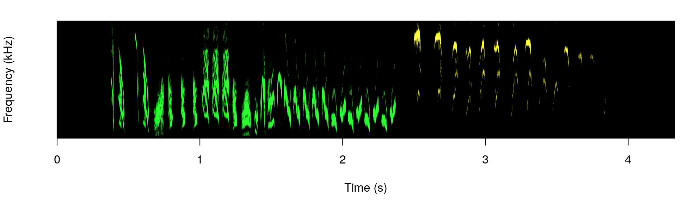

dynaSpec
================

<!-- README.md is generated from README.Rmd. Please edit that file -->
[](https://cran.r-project.org/package=dynaSpec) [](http://www.r-pkg.org/pkg/dynaSpec) [](https://r-pkg.org/pkg/dynaSpec) [](https://www.tidyverse.org/lifecycle/#experimental)

A set of tools to generate dynamic spectrogram visualizations in video format. [FFMPEG](https://ffmpeg.org/download.html) must be installed in order for this package to work. The package relies heavily on the packages [seewave](https://CRAN.R-project.org/package=seewave) and [tuneR](https://CRAN.R-project.org/package=tuneR).

Install/load the package from CRAN as follows (**NOT YET IN CRAN**):

``` r

# From CRAN would be
#install.packages("dynaSpec")

#load package
library(dynaSpec)

# and load other dependencies
library(viridis)
library(tuneR)
library(seewave)
```

To install the latest developmental version from [github](http://github.com/) you will need the R package [devtools](https://cran.r-project.org/package=devtools):

``` r

# From github
devtools::install_github("maRce10/dynaSpec")

#load package
library(dynaSpec)
```

Examples
--------

To run the following examples you will also need to load a few more packages as well as [warbleR](https://cran.r-project.org/package=warbleR) 1.1.24 (currently as the developmental version on github). It can be installed as follows:

``` r

# From github
devtools::install_github("maRce10/warbleR")

#load package
library(warbleR)
library(viridis)
```

A dynamic spectrogram of a canyon wren song with a viridis color palette:

``` r


data("canyon_wren")

scrolling_spectro(wave = canyon_wren, wl = 300, 
              t.display = 1.7, pal = viridis, 
              grid = FALSE, flim = c(1, 9), 
              width = 1000, height = 500, 
              res = 120, file.name = "default.mp4")
```

<center>
<iframe allowtransparency="true" style="background: #FFFFFF;" style="border:0px solid lightgrey;" width="600" height="240" src="https://www.youtube.com/embed/TOiukDxaNbI" frameborder="0" allow="accelerometer; autoplay; encrypted-media; gyroscope; picture-in-picture" allowfullscreen>
</iframe>
</center>
 

Black and white spectrogram:

``` r

scrolling_spectro(wave = canyon_wren, wl = 300, 
          t.display = 1.7, pal = reverse.gray.colors.1, 
          grid = FALSE, flim = c(1, 9), 
          width = 1000, height = 500, 
          res = 120, file.name = "black_and_white.mp4",
          collevels = seq(-100, 0, 5))
```

<center>
<iframe allowtransparency="true" style="background: #FFFFFF;" style="border:0px solid lightgrey;" width="600" height="240" src="https://www.youtube.com/embed/5gQjgzijHOs" frameborder="0" allow="accelerometer; autoplay; encrypted-media; gyroscope; picture-in-picture" allowfullscreen>
</iframe>
</center>
 

A spectrogram with black background (colbg = "black"):

``` r

scrolling_spectro(wave = canyon_wren, wl = 300, 
              t.display = 1.7, pal = viridis, 
              grid = FALSE, flim = c(1, 9), 
              width = 1000, height = 500, res = 120, 
              file.name = "black.mp4", colbg = "black")
```

<center>
<iframe allowtransparency="true" style="background: #FFFFFF;" style="border:0px solid lightgrey;" width="600" height="240" src="https://www.youtube.com/embed/n_GNDn2VH-U" frameborder="0" allow="accelerometer; autoplay; encrypted-media; gyroscope; picture-in-picture" allowfullscreen>
</iframe>
</center>
 

Slow down to 1/2 speed (speed = 0.5) with a oscillogram at the bottom (osc = TRUE):

``` r

scrolling_spectro(wave = canyon_wren, wl = 300, 
              t.display = 1.7, pal = viridis, 
              grid = FALSE, flim = c(1, 9), 
              width = 1000, height = 500, res = 120, 
              file.name = "slow.mp4", colbg = "black",
              speed = 0.5, osc = TRUE, 
              colwave = "#31688E99")
```

<center>
<iframe allowtransparency="true" style="background: #FFFFFF;" style="border:0px solid lightgrey;" width="600" height="240" src="https://www.youtube.com/embed/r25TSKSklLo" frameborder="0" allow="accelerometer; autoplay; encrypted-media; gyroscope; picture-in-picture" allowfullscreen>
</iframe>
</center>
 

 

Long-billed hermit song at 1/5 speed (speed = 0.5), removing axes and looping 3 times (loop = 3:

``` r

data("Phae.long4")

scrolling_spectro(wave = Phae.long4, wl = 300, 
    t.display = 1.7, ovlp = 90, pal = magma, 
    grid = FALSE, flim = c(1, 10), width = 1000, 
    height = 500, res = 120, collevels = seq(-50, 0, 5), 
    file.name = "no_axis.mp4", colbg = "black", 
    speed = 0.2, axis.type = "none", loop = 3)
```

<center>
<iframe allowtransparency="true" style="background: #FFFFFF;" style="border:0px solid lightgrey;" width="600" height="360" src="https://www.youtube.com/embed/7AAoaZUkA3k" frameborder="0" allow="accelerometer; autoplay; encrypted-media; gyroscope; picture-in-picture" allowfullscreen>
</iframe>
</center>
 

Visualizing a northern nightingale wren recording from [xeno-canto](xeno-canto.org) using a custom color palette:

``` r

ngh_wren <- read_wave("https://www.xeno-canto.org/518334/download")

custom_pal <- colorRampPalette( c("#2d2d86", "#2d2d86", reverse.terrain.colors(10)[5:10]))

scrolling_spectro(wave = ngh_wren, wl = 600, 
    t.display = 3, ovlp = 95, pal = custom_pal, 
    grid = FALSE, flim = c(2, 8), width = 700, 
    height = 250, res = 100, collevels = seq(-40, 0, 5),
    file.name = "../nightingale_wren.mp4", colbg = "#2d2d86", lcol = "#FFFFFFE6")
```

<center>
<iframe allowtransparency="true" style="background: #FFFFFF;" style="border:0px solid lightgrey;" width="700" height="250" src="https://www.youtube.com/embed/OxvKoPyX-4o" frameborder="0" allow="accelerometer; autoplay; encrypted-media; gyroscope; picture-in-picture" allowfullscreen>
</iframe>
</center>
 

Spectral derivatives (need the package 'imager' installed), looping 3 times (loop = 3; doesn't look great on youtube!):

``` r


scrolling_spectro(wave = canyon_wren, wl = 512, 
    t.display = 1.7, ovlp = 90, pal = reverse.gray.colors.1, 
    grid = FALSE, flim = c(1, 8), width = 1000, 
    height = 500, res = 200, collevels = seq(-40, 0, 5), derivative = TRUE,
    file.name = "spectral_derivatives.mp4", loop = 3)
```

<center>
<iframe allowtransparency="true" style="background: #FFFFFF;" style="border:0px solid lightgrey;" width="600" height="240" src="https://www.youtube.com/embed/JbQ741ZlZ2A" frameborder="0" allow="accelerometer; autoplay; encrypted-media; gyroscope; picture-in-picture" allowfullscreen>
</iframe>
</center>
 

Spix's disc-winged bat inquiry call slow down (speed = 0.05):

``` r

data("thyroptera.est")

# extract one call
thy_wav <- attributes(thyroptera.est)$wave.objects[[12]]

# add silence at both "sides""
thy_wav <- pastew(tuneR::silence(duration = 0.05, 
                                 samp.rate = thy_wav@samp.rate, xunit = "time"),thy_wav, output = "Wave")

thy_wav <- pastew(thy_wav, tuneR::silence(duration = 0.04, 
                                          samp.rate = thy_wav@samp.rate, xunit = "time"), output = "Wave")

scrolling_spectro(wave = thy_wav, wl = 400, 
    t.display = 0.08, ovlp = 95, pal = inferno, 
    grid = FALSE, flim = c(12, 37), width = 700, 
    height = 250, res = 100, collevels = seq(-40, 0, 5),
    file.name = "thyroptera_osc.mp4", colbg = "black", lcol = "#FFFFFFE6", 
    speed = 0.05, fps = 200, buffer = 0, loop = 4, lty = 1, 
    osc = TRUE, colwave = inferno(10, alpha = 0.9)[3])
```

<center>
<iframe allowtransparency="true" style="background: #FFFFFF;" style="border:0px solid lightgrey;" width="700" height="250" src="https://www.youtube.com/embed/mFiYPzOe9Nw" frameborder="0" allow="accelerometer; autoplay; encrypted-media; gyroscope; picture-in-picture" allowfullscreen>
</iframe>
</center>
 

### Further customization

The argument 'spectro.call' allows to insert customized spectrogram visualizations. For instance, the following code makes use of the `color_spectro()` function from [warbleR](https://cran.r-project.org/package=warbleR) to highlight with colors vocalizations from male and female house wrens (first we download the selection table and sound file from figshare):

``` r

# get house wren male female duet recording
hs_wren <- read_wave("https://ndownloader.figshare.com/files/22722101")

# and extended selection table
st <- read.csv("https://ndownloader.figshare.com/files/22722404")

# create color column
st$colors <- c("green", "yellow")

# highlight selections
color.spectro(wave = hs_wren, wl = 200, ovlp = 95, flim = c(1, 13), 
              collevels = seq(-55, 0, 5), dB = "B", X = st, col.clm = "colors", 
              base.col = "black",  t.mar = 0.07, f.mar = 0.1, strength = 3, interactive = NULL, 
              bg.col = "black")
```



This looks a bit busy here, but will spread out in the dynamic spectrogram.

We can wrap the `color_spectro()` call using the `call()` function form base R and input that into `scrolling_spectro()` using the argument 'spectro.call':

``` r
# save call
sp_cl <- call("color.spectro", wave = hs_wren, wl = 200, ovlp = 95, 
              flim = c(1, 13), collevels = seq(-55, 0, 5), strength = 3,
              dB = "B", X = st, col.clm = "colors", base.col = "black",  t.mar = 0.07, f.mar = 0.1, 
              interactive = NULL, bg.col = "black")

# create dynamic spectrogram
scrolling_spectro(wave = hs_wren, wl = 512,  
                  t.display = 1.2, pal = reverse.gray.colors.1, 
                  grid = FALSE, flim = c(1, 13), loop = 3,
                  width = 1000, height = 500, res = 120,
                  collevels = seq(-100, 0, 1), spectro.call = sp_cl, fps = 60,
                  file.name = "yellow_and_green.mp4")
```

<center>
<iframe allowtransparency="true" style="background: #FFFFFF;" style="border:0px solid lightgrey;" width="700" height="350" src="https://www.youtube.com/embed/9qMPxYuGUJE" frameborder="0" allow="accelerometer; autoplay; encrypted-media; gyroscope; picture-in-picture" allowfullscreen>
</iframe>
</center>
 

This option can be mixed with any of the other customizations in the function, as adding an oscillogram:

``` r

# create dynamic spectrogram
scrolling_spectro(wave = hs_wren, wl = 512, osc = TRUE,
                  t.display = 1.2, pal = reverse.gray.colors.1, 
                  grid = FALSE, flim = c(1, 13), loop = 3, 
                  width = 1000, height = 500, res = 120, 
                  collevels = seq(-100, 0, 1), 
                  spectro.call = sp_cl, fps = 60,
                  file.name = "yellow_and_green_oscillo.mp4")
```

<center>
<iframe allowtransparency="true" style="background: #FFFFFF;" style="border:0px solid lightgrey;" width="700" height="350" src="https://www.youtube.com/embed/k6OumiKsRWw" frameborder="0" allow="accelerometer; autoplay; encrypted-media; gyroscope; picture-in-picture" allowfullscreen>
</iframe>
</center>
 

A viridis color palette:

``` r

st$colors <- viridis(10)[c(3, 8)]

sp_cl <- call("color.spectro", wave = hs_wren, wl = 200, 
              ovlp = 95, flim = c(1, 13), collevels = seq(-55, 0, 5),
              dB = "B", X = st, col.clm = "colors", base.col = "white",  
              t.mar = 0.07, f.mar = 0.1, strength = 3, interactive = NULL)

# create dynamic spectrogram
scrolling_spectro(wave = hs_wren, wl = 200, osc = TRUE,
                  t.display = 1.2, pal = reverse.gray.colors.1, 
                  grid = FALSE, flim = c(1, 13), loop = 3, 
                  width = 1000, height = 500, res = 120, 
                  collevels = seq(-100, 0, 1), colwave = viridis(10)[c(9)],
                  spectro.call = sp_cl, fps = 60,
                  file.name = "viridis.mp4")
```

<center>
<iframe allowtransparency="true" style="background: #FFFFFF;" style="border:0px solid lightgrey;" width="700" height="350" src="https://www.youtube.com/embed/HvV2NFuJeIU" frameborder="0" allow="accelerometer; autoplay; encrypted-media; gyroscope; picture-in-picture" allowfullscreen>
</iframe>
</center>
 

Or simply a gray scale:

``` r

st$colors <- c("gray", "gray49")

sp_cl <- call("color.spectro", wave = hs_wren, wl = 200, ovlp = 95, flim = c(1, 13), 
              collevels = seq(-55, 0, 5), dB = "B", X = st, col.clm = "colors", base.col = "white",  
              t.mar = 0.07, f.mar = 0.1, strength = 3, interactive = NULL)

# create dynamic spectrogram
scrolling_spectro(wave = hs_wren, wl = 512, osc = TRUE,
                  t.display = 1.2, pal = reverse.gray.colors.1, 
                  grid = FALSE, flim = c(1, 13), loop = 3, 
                  width = 1000, height = 500, res = 120, 
                  collevels = seq(-100, 0, 1), 
                  spectro.call = sp_cl, fps = 60,
                  file.name = "gray.mp4")
```

<center>
<iframe allowtransparency="true" style="background: #FFFFFF;" style="border:0px solid lightgrey;" width="700" height="350" src="https://www.youtube.com/embed/gd096zAG5NE" frameborder="0" allow="accelerometer; autoplay; encrypted-media; gyroscope; picture-in-picture" allowfullscreen>
</iframe>
</center>
 

------------------------------------------------------------------------

Please cite [dynaSpec](https://marce10.github.io/dynaSpec/) as follows:

Araya-Salas M & M. Wilkins. (2020), *dynaSpec: dynamic spectrogram visualizations in R*. R package version 1.0.0.
