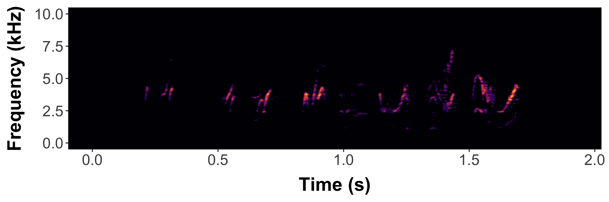

dynaSpec: dynamic spectrogram visualizations
================

<!-- README.md is generated from README.Rmd. Please edit that file -->
<!-- badges: start -->

[](https://lifecycle.r-lib.org/articles/stages.html)
[](https://www.repostatus.org/#active)
[](https://www.gnu.org/licenses/gpl-3.0.en.html)
[](https://cran.r-project.org/)
[](https://cran.r-project.org/package=dynaSpec)
[](https://cranlogs.r-pkg.org/badges/grand-total/dynaSpec)
<!-- badges: end -->


A set of tools to generate dynamic spectrogram visualizations in video
format. [FFMPEG](https://ffmpeg.org/download.html) must be installed in
order for this package to work (check [this link for
instructions](https://www.rdocumentation.org/packages/ndtv/versions/0.13.3/topics/install.ffmpeg)
and this [link for troubleshooting installation on
Windows](https://github.com/maRce10/dynaSpec/issues/3)). The package
relies heavily on the packages
[seewave](https://CRAN.R-project.org/package=seewave) and
[tuneR](https://CRAN.R-project.org/package=tuneR).

Please cite [dynaSpec](https://marce10.github.io/dynaSpec/) as follows:

Araya-Salas, Marcelo & Wilkins, Matthew R.. (2020), *dynaSpec: dynamic
spectrogram visualizations in R*. R package version 1.0.0.

Install/load the package from CRAN as follows:

``` r

# From CRAN would be
install.packages("dynaSpec")

#load package
library(dynaSpec)

# and load other dependencies
library(viridis)
library(tuneR)
library(seewave)
```

To install the latest developmental version from
[github](https://github.com/) you will need the R package
[remotes](https://cran.r-project.org/package=remotes):

``` r

# From github
remotes::install_github("maRce10/dynaSpec")

#load package
library(dynaSpec)
```

Installation of external dependencies can be tricky on operating systems
other than Linux. An alternative option is to run the package through
[google colab](https://colab.google/). This [colab
notebook](https://colab.research.google.com/drive/1t3Wn9OifcZTvxOMVNmz9dF25vnzU3_Fr?usp=sharing)
explain how to do that step-by-step.

# Background

This package is a collaboration between [Marcelo
Araya-Salas](https://marce10.github.io/) and [Matt
Wilkins](https://www.mattwilkinsbio.com/). The goal is to create static
and dynamic visualizations of sounds, ready for publication or
presentation, *without taking screen shots* of another program.
[Marcelo’s approach](#marcelos-approach-scrolling-dynamic-spectrograms)
(implemented in the scrolling_spectro() function) shows a spectrogram
sliding past a fixed point as sounds are played, similar to that
utilized in Cornell’s Macaulay Library of Sounds. These dynamic
spectrograms are produced natively with base graphics. [Matt’s
approach](#matts-approach-paged-dynamic-spectrograms) creates “paged”
spectrograms that are revealed by a sliding highlight box as sounds are
played, akin to Adobe Audition’s spectral view. This approach is in
ggplot2 natively, and requires setting up spec parameters and segmenting
sound files with prep_static_ggspectro(), the result of which is
processed with paged_spectro() to generate a dynamic spectrogram.

<hr>

# Marcelo’s Approach: “Scrolling Dynamic Spectrograms”

<hr>

To run the following examples you will also need to load a few more
packages as well as
[warbleR](https://cran.r-project.org/package=warbleR) \>= 1.1.24. It can
be installed as follows:

``` r

# From github
devtools::install_github("maRce10/warbleR")

#load package
library(warbleR)
```

A dynamic spectrogram of a canyon wren song with a viridis color
palette:

``` r


data("canyon_wren")

scrolling_spectro(wave = canyon_wren, wl = 300, 
              t.display = 1.7, pal = viridis, 
              grid = FALSE, flim = c(1, 9), 
              width = 1000, height = 500, 
              res = 120, file.name = "default.mp4")
```

<https://github.com/user-attachments/assets/8323b6cd-8ddd-4d4f-9e42-4adad90f2c74>

Black and white spectrogram:

``` r

scrolling_spectro(wave = canyon_wren, wl = 300, 
          t.display = 1.7, pal = reverse.gray.colors.1, 
          grid = FALSE, flim = c(1, 9), 
          width = 1000, height = 500, 
          res = 120, file.name = "black_and_white.mp4",
          collevels = seq(-100, 0, 5))
```

<https://github.com/user-attachments/assets/2a9adf9b-3618-4700-8843-4412177da0df>

A spectrogram with black background (colbg = “black”):

``` r

scrolling_spectro(wave = canyon_wren, wl = 300, 
              t.display = 1.7, pal = viridis, 
              grid = FALSE, flim = c(1, 9), 
              width = 1000, height = 500, res = 120, 
              file.name = "black.mp4", colbg = "black")
```

<https://github.com/user-attachments/assets/c4dc7ebc-4406-4d86-a828-94a4f6516762>

Slow down to 1/2 speed (speed = 0.5) with a oscillogram at the bottom
(osc = TRUE):

``` r

scrolling_spectro(wave = canyon_wren, wl = 300, 
              t.display = 1.7, pal = viridis, 
              grid = FALSE, flim = c(1, 9), 
              width = 1000, height = 500, res = 120, 
              file.name = "slow.mp4", colbg = "black",
              speed = 0.5, osc = TRUE, 
              colwave = "#31688E99")
```

<https://github.com/user-attachments/assets/0eb2ed26-d2e7-451e-ba00-3c2ec527bafe>

Long-billed hermit song at 1/5 speed (speed = 0.5), removing axes and
looping 3 times (loop = 3:

``` r

data("Phae.long4")

scrolling_spectro(wave = Phae.long4, wl = 300, 
    t.display = 1.7, ovlp = 90, pal = magma, 
    grid = FALSE, flim = c(1, 10), width = 1000, 
    height = 500, res = 120, collevels = seq(-50, 0, 5), 
    file.name = "no_axis.mp4", colbg = "black", 
    speed = 0.2, axis.type = "none", loop = 3)
```

<https://github.com/user-attachments/assets/a35b145e-2295-4050-811a-7d942cb56a92>

Visualizing a northern nightingale wren recording from
[xeno-canto](https://www.xeno-canto.org) using a custom color palette:

``` r

ngh_wren <- read_sound_file("https://www.xeno-canto.org/518334/download")

custom_pal <- colorRampPalette( c("#2d2d86", "#2d2d86", reverse.terrain.colors(10)[5:10]))

scrolling_spectro(wave = ngh_wren, wl = 600, 
    t.display = 3, ovlp = 95, pal = custom_pal, 
    grid = FALSE, flim = c(2, 8), width = 700, 
    height = 250, res = 100, collevels = seq(-40, 0, 5),
    file.name = "../nightingale_wren.mp4", colbg = "#2d2d86", lcol = "#FFFFFFE6")
```

<https://github.com/user-attachments/assets/1b5e318e-1f52-4345-80a3-9d4c6199b85a>

Spix’s disc-winged bat inquiry call slow down (speed = 0.05):

``` r

data("thyroptera.est")

# extract one call
thy_wav <- attributes(thyroptera.est)$wave.objects[[12]]

# add silence at both "sides""
thy_wav <- pastew(tuneR::silence(duration = 0.05, 
            samp.rate = thy_wav@samp.rate, xunit = "time"),
            thy_wav, output = "Wave")

thy_wav <- pastew(thy_wav, tuneR::silence(duration = 0.04, 
            samp.rate = thy_wav@samp.rate, xunit = "time"),
            output = "Wave")

scrolling_spectro(wave = thy_wav, wl = 400, 
    t.display = 0.08, ovlp = 95, pal = inferno, 
    grid = FALSE, flim = c(12, 37), width = 700, 
    height = 250, res = 100, collevels = seq(-40, 0, 5),
    file.name = "thyroptera_osc.mp4", colbg = "black", lcol = "#FFFFFFE6", 
    speed = 0.05, fps = 200, buffer = 0, loop = 4, lty = 1, 
    osc = TRUE, colwave = inferno(10, alpha = 0.9)[3])
```

<https://github.com/user-attachments/assets/a0e4fdda-8aeb-4ee2-9192-0a260ba3dfdd>

### Further customization

The argument ‘spectro.call’ allows to insert customized spectrogram
visualizations. For instance, the following code makes use of the
`color_spectro()` function from
[warbleR](https://cran.r-project.org/package=warbleR) to highlight
vocalizations from male and female house wrens with different colors
(after downloading the selection table and sound file from figshare):

``` r

# get house wren male female duet recording
hs_wren <- read_sound_file("https://ndownloader.figshare.com/files/22722101")

# and extended selection table
st <- read.csv("https://ndownloader.figshare.com/files/22722404")

# create color column
st$colors <- c("green", "yellow")

# highlight selections
color.spectro(wave = hs_wren, wl = 200, ovlp = 95, flim = c(1, 13), 
              collevels = seq(-55, 0, 5), dB = "B", X = st, col.clm = "colors", 
              base.col = "black",  t.mar = 0.07, f.mar = 0.1, strength = 3, 
              interactive = NULL, bg.col = "black")
```


The male part is shown in green and the female part in yellow.

We can wrap the `color_spectro()` call using the `call()` function form
base R and input that into `scrolling_spectro()` using the argument
‘spectro.call’:

``` r
# save call
sp_cl <- call("color.spectro", wave = hs_wren, wl = 200, ovlp = 95, 
              flim = c(1, 13), collevels = seq(-55, 0, 5), strength = 3,
              dB = "B", X = st, col.clm = "colors", base.col = "black",  
              t.mar = 0.07, f.mar = 0.1, interactive = NULL, bg.col = "black")

# create dynamic spectrogram
scrolling_spectro(wave = hs_wren, wl = 512,  
                  t.display = 1.2, pal = reverse.gray.colors.1, 
                  grid = FALSE, flim = c(1, 13), loop = 3,
                  width = 1000, height = 500, res = 120,
                  collevels = seq(-100, 0, 1), spectro.call = sp_cl, fps = 60,
                  file.name = "yellow_and_green.mp4")
```

<https://github.com/user-attachments/assets/71636997-ddb5-4243-8774-c6843ad76db5>

This option can be mixed with any of the other customizations in the
function, as adding an oscillogram:

``` r

# create dynamic spectrogram
scrolling_spectro(wave = hs_wren, wl = 512, osc = TRUE,
                  t.display = 1.2, pal = reverse.gray.colors.1, 
                  grid = FALSE, flim = c(1, 13), loop = 3, 
                  width = 1000, height = 500, res = 120, 
                  collevels = seq(-100, 0, 1), 
                  spectro.call = sp_cl, fps = 60,
                  file.name = "yellow_and_green_oscillo.mp4")
```

<https://github.com/user-attachments/assets/41ca7f67-c121-4c60-8b66-31fceff00c33>

A viridis color palette:

``` r

st$colors <- viridis(10)[c(3, 8)]

sp_cl <- call("color.spectro", wave = hs_wren, wl = 200, 
              ovlp = 95, flim = c(1, 13), collevels = seq(-55, 0, 5),
              dB = "B", X = st, col.clm = "colors", 
              base.col = "white", t.mar = 0.07, f.mar = 0.1,
              strength = 3, interactive = NULL)

# create dynamic spectrogram
scrolling_spectro(wave = hs_wren, wl = 200, osc = TRUE,
                  t.display = 1.2, pal = reverse.gray.colors.1, 
                  grid = FALSE, flim = c(1, 13), loop = 3, 
                  width = 1000, height = 500, res = 120, 
                  collevels = seq(-100, 0, 1), colwave = viridis(10)[c(9)],
                  spectro.call = sp_cl, fps = 60,
                  file.name = "viridis.mp4")
```

<https://github.com/user-attachments/assets/e1bf389e-6056-4df0-a23b-b09d7e65e952>

Or simply a gray scale:

``` r

st$colors <- c("gray", "gray49")

sp_cl <- call("color.spectro", wave = hs_wren, wl = 200, ovlp = 95, flim = c(1, 13), 
              collevels = seq(-55, 0, 5), dB = "B", X = st, col.clm = "colors", 
              base.col = "white", t.mar = 0.07, f.mar = 0.1, strength = 3, 
              interactive = NULL)

# create dynamic spectrogram
scrolling_spectro(wave = hs_wren, wl = 512, osc = TRUE,
                  t.display = 1.2, pal = reverse.gray.colors.1, 
                  grid = FALSE, flim = c(1, 13), loop = 3, 
                  width = 1000, height = 500, res = 120, 
                  collevels = seq(-100, 0, 1), 
                  spectro.call = sp_cl, fps = 60,
                  file.name = "gray.mp4")
```

<https://github.com/user-attachments/assets/8efc0019-ea82-4ace-8176-3abd0315ae5a>

The ‘spectro.call’ argument can also be used to add annotations. To do
this we need to wrap up both the spectrogram function and the annotation
functions (i.e. `text()`, `lines()`) in a single function and then save
the call to that function:

``` r

# create color column
st$colors <- viridis(10)[c(3, 8)]

# create label column
st$labels <- c("male", "female")

# shrink end of second selection (purely aesthetics)
st$end[2] <- 3.87

  # function to highlight selections
ann_fun <- function(wave, X){
  
  # print spectrogram
  color.spectro(wave = wave,  wl = 200, 
              ovlp = 95, flim = c(1, 18.6), collevels = seq(-55, 0, 5),
              dB = "B", X = X, col.clm = "colors", 
              base.col = "white", t.mar = 0.07, f.mar = 0.1,
              strength = 3, interactive = NULL)
  
  # annotate each selection in X 
  for(e in 1:nrow(X)){  
    # label
    text(x = X$start[e] + ((X$end[e] - X$start[e]) / 2), 
         y = 16.5, labels = X$labels[e], cex = 3.3, 
         col = adjustcolor(X$colors[e], 0.6))
    
    # line
    lines(x = c(X$start[e], X$end[e]), y = c(14.5, 14.5), 
          lwd = 6, col = adjustcolor("gray50", 0.3))
  }
  
}

# save call
ann_cl <- call("ann_fun", wave = hs_wren, X = st)

# create annotated dynamic spectrogram
scrolling_spectro(wave = hs_wren, wl = 200, t.display = 1.2, 
                  grid = FALSE, flim = c(1, 18.6), loop = 3, 
                  width = 1000, height = 500, res = 200, 
                  collevels = seq(-100, 0, 1), speed = 0.5,
                  spectro.call = ann_cl, fps = 120,
                  file.name = "../viridis_annotated.mp4")
```

<https://github.com/user-attachments/assets/b72e466a-b88a-4804-8f95-5960b3749e9c>

Finally, the argument ‘annotation.call’ can be used to add static labels
(i.e. non-scrolling). It works similar to ‘spectro.call’, but requires a
call from `text()`. This let users customize things as size, color,
position, font, and additional arguments taken by `text()`. The call
should also include the argmuents ‘start’ and ‘end’ to indicate the time
at which the labels are displayed (in s). ‘fading’ is optional and
allows fade-in and fade-out effects on labels (in s as well). The
following code downloads a recording containing several frog species
recorded in Costa Rica from figshare, cuts a clip including two species
and labels it with a single label:

``` r

# read data from figshare
frogs <- read_sound_file("https://ndownloader.figshare.com/files/22829075")

# cut a couple of species
shrt_frgs <- cutw(frogs, from = 35.3, to = 50.5, output = "Wave")

# make annotation call
ann_cll <- call("text", x = 0.25, y = 0.87, 
                labels = "Frog calls", cex = 1, start = 0.2, end = 14, 
                col = "#FFEA46CC", font = 3, fading = 0.6)

# create dynamic spectro
scrolling_spectro(wave = shrt_frgs, wl = 512, ovlp = 95,  
                  t.display = 1.1, pal = cividis,
                  grid = FALSE, flim = c(0, 5.5), loop = 3,
                  width = 1200, height = 550, res = 200,
                  collevels = seq(-40, 0, 5), lcol =  "#FFFFFFCC", 
                  colbg = "black", fps = 60, file.name = "../frogs.mp4",
                  osc = TRUE, height.prop = c(3, 1), colwave = "#31688E", 
                  lty = 3, annotation.call = ann_cll)
```

<https://github.com/user-attachments/assets/ee6c170b-9412-475c-be53-f17d3748c992>

The argument accepts more than one labels as in a regular `text()` call.
In that case ‘start’ and ‘end’ values should be supplied for each label:

``` r

# make annotation call for 2 annotations
ann_cll <- call(
  "text",
  x = 0.25,
  y = 0.87,
  labels = c("Dendropsophus ebraccatus", "Eleutherodactylus coqui"),
  cex = 1,
  start = c(0.4, 7),
  end = c(5.5, 14.8),
  col = "#FFEA46CC",
  font = 3,
  fading = 0.6
)

# create dynamic spectro
scrolling_spectro(
  wave = shrt_frgs,
  wl = 512,
  ovlp = 95,
  t.display = 1.1,
  pal = cividis,
  grid = FALSE,
  flim = c(0, 5.5),
  loop = 3,
  width = 1200,
  height = 550,
  res = 200,
  collevels = seq(-40, 0, 5),
  lcol =  "#FFFFFFCC",
  colbg = "black",
  fps = 60,
  file.name = "../frogs_sp_labels.mp4",
  osc = TRUE,
  height.prop = c(3, 1),
  colwave = "#31688E",
  lty = 3,
  annotation.call = ann_cll
)
```

<https://github.com/user-attachments/assets/bbd9ea9c-b153-4f4d-a56f-ea851c231151>

<hr>

# Matt’s approach: “Paged Dynamic Spectrograms”

<hr>

### Workflow

1.  Tweak your spectrogram settings using the prep_static_ggspectro()
    function – aka prepStaticSpec() – storing results in variable. You
    can also just segment and export static specs at this step.
2.  Feed variable into paged_spectro() – aka pagedSpec() – to generate a
    dynamic spectrogram
    - It does this by exporting a PNG of the testSpec() ggplot function;
    - Import PNG as a new ggplot raster layer
    - Overlay a series of translucent highlight boxes that disolve away
      using gganimate

<!-- -->

    #list WAVs included with dynaSpec
    (f<-system.file(package="dynaSpec") |> list.files(pattern=".wav",full.names=T))

    #store output and save spectrogram to working directory
    params <-prep_static_ggspectro(f[1],destFolder="wd",savePNG=T)

### Static spectrogram of a female barn swallow song

<figure>

<figcaption aria-hidden="true">Static Spectrogram of a female barn
swallow song</figcaption>
</figure>

``` r

#let's add axes 
femaleBarnSwallow<-prep_static_ggspectro(f[1],destFolder=tempdir(),savePNG=T,onlyPlotSpec = F)
```

<figure>

<figcaption aria-hidden="true">Static spectrogram with axis labels for
female barn swallow song</figcaption>
</figure>

``` r

#Now generate a dynamic spectrogram
paged_spectro(femaleBarnSwallow)
```

### Dynamic spectrogram of a female barn swallow song

<https://github.com/user-attachments/assets/618260a3-fdcc-46aa-a36b-e8a8a1d78d9a>

### Now brighten the spec using the ampTrans parameter

- ampTrans=3 is a nonlinear signal booster. Basically collapses the
  difference between loudest and quietest values (higher values=
  brighter specs); 1 (default) means no transformation
- Here, I also lowered the decibel threshold to include some quieter
  sounds with min_dB=-35; default is -30
- bgFlood=T makes the axis area the same color as the plot background.
  It will automatically switch to white axis font if background is too
  dark.
- Then generate dynamic spectrogram

``` r

#note that prep_static_spectro() is tha same as prepStaticSpec()
#Also paged_spectro() is the same as pagedSpec()

p2<-prep_static_ggspectro(f[1],min_dB=-35, savePNG=T, destFolder="wd",onlyPlotSpec=F,bgFlood=T,ampTrans=3) 
paged_spectro(p2) 
```

<figure>

<figcaption aria-hidden="true">Static spectrogram with axis labels for
female barn swallow song</figcaption>
</figure>

<https://github.com/user-attachments/assets/ef7a2802-3d19-4d5a-a902-71495f47f10f>

### Now also supports .mp3 files (web or local) and multi-page dynamic spectrograms (i.e. cropping and segmenting spectrograms from larger recording files)

- Long files may take a long time to render, depending on CPU power…
  - the default is to not plot axes and labels (onlyPlotSpec=T)
  - crop=12 is interpreted as: only use the first 12 seconds of the
    file; can also specify interval w/ c(0,12)
  - xLim=3 specifies the “page window” i.e. how many seconds each “page”
    of the dynamic spectrogram should display, here 3 sec
  - here we also limit the yLim of the plot to the vocalized frequencies
    from 0 to 700 Hz (0.7 kHz)

``` r

whale <- prep_static_ggspectro("http://www.oceanmammalinst.org/songs/hmpback3.wav",
       savePNG=T,destFolder="wd",yLim=c(0,.7),crop=12,xLim=3,ampTrans=3) 
paged_spectro(whale)
#Voila 🐋
```

### Static whale song spectrogram

<figure>

<figcaption aria-hidden="true">Humpback whale song
spectrogram</figcaption>
</figure>

### Dynamic multipage whale song spectrogram

<https://github.com/user-attachments/assets/ed75fd8f-1a0e-475a-95b9-2df809caa695>

### Example using Xeno-Canto to generate a multi-page dynamic spectrogram of a common nighthawk call (w/ different color scheme)

``` r

song="https://www.xeno-canto.org/sounds/uploaded/SPMWIWZKKC/XC490771-190804_1428_CONI.mp3"
temp=prep_static_ggspectro(song,crop=20,xLim=4,colPal = c("white","black"))
paged_spectro(temp,vidName="nightHawk" ,highlightCol = "#d1b0ff",cursorCol = "#7817ff")
```

### Nighthawk multipage dynamic spec

<https://github.com/user-attachments/assets/ad4b635b-804d-4340-965c-d382376aabb6>

Enjoy! Please share your specs with us on Twitter!
[@M_Araya_Salas](https://twitter.com/M_Araya_Salas) &
[@mattwilkinsbio](https://twitter.com/mattwilkinsbio)

------------------------------------------------------------------------

Please cite [dynaSpec](https://marce10.github.io/dynaSpec/) as follows:

Araya-Salas, Marcelo and Wilkins, Matthew R. (2020), *dynaSpec: dynamic
spectrogram visualizations in R*. R package version 1.0.0.
